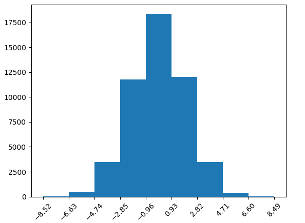
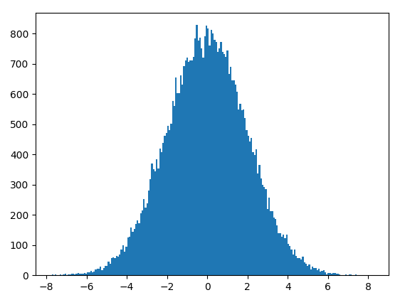
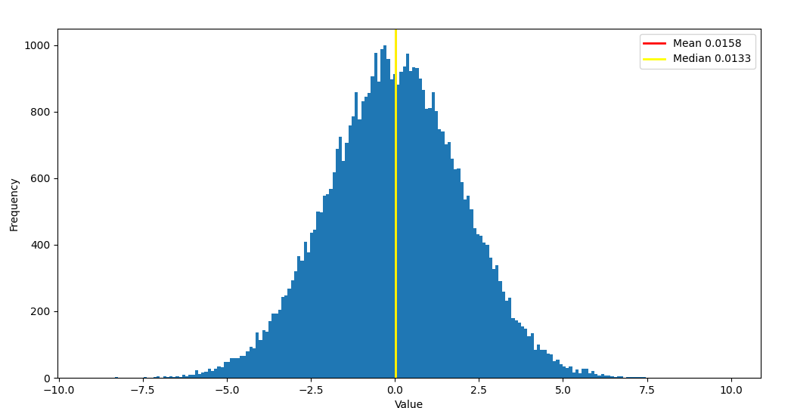
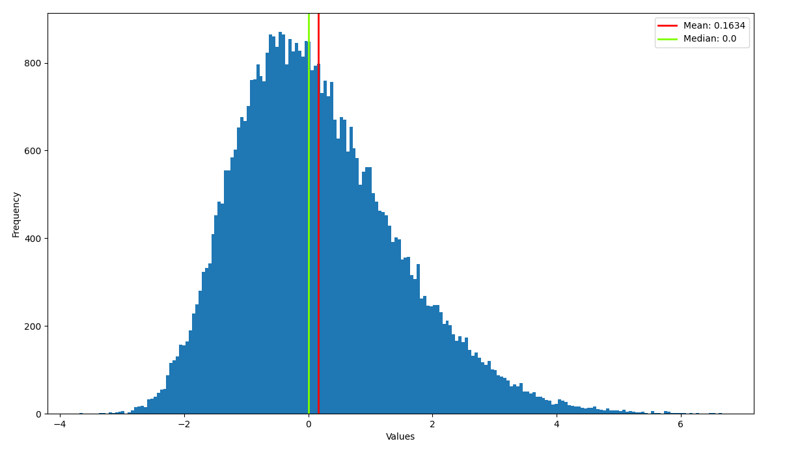
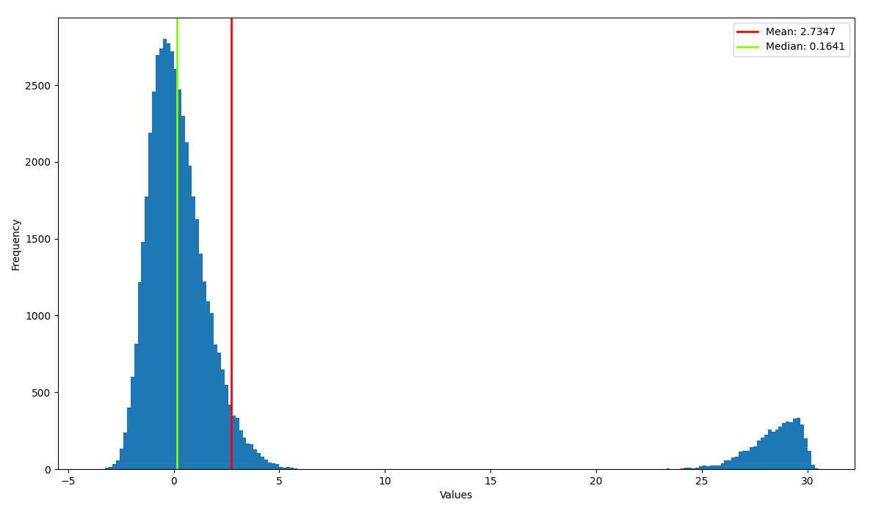
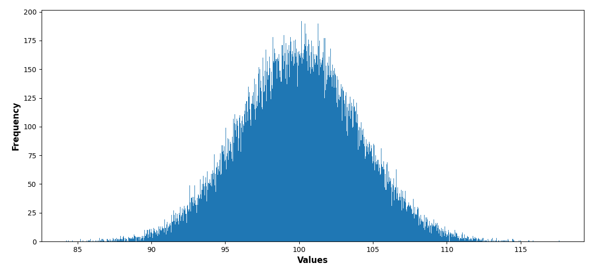
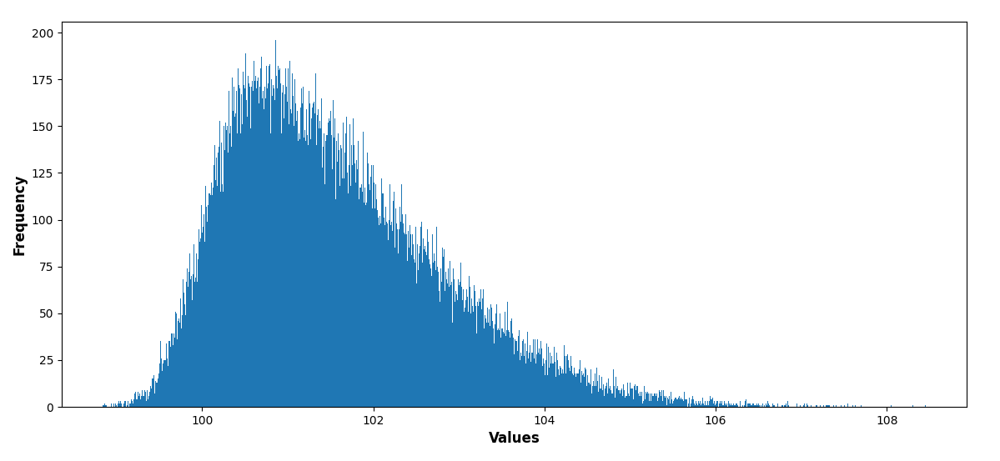
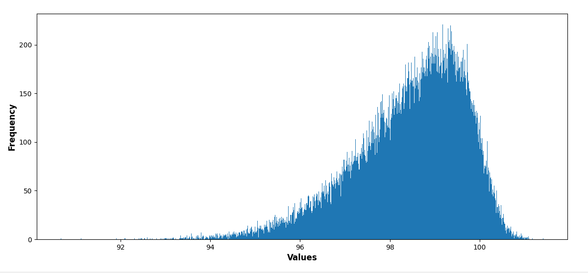
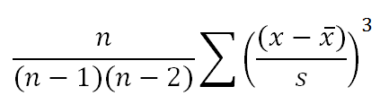
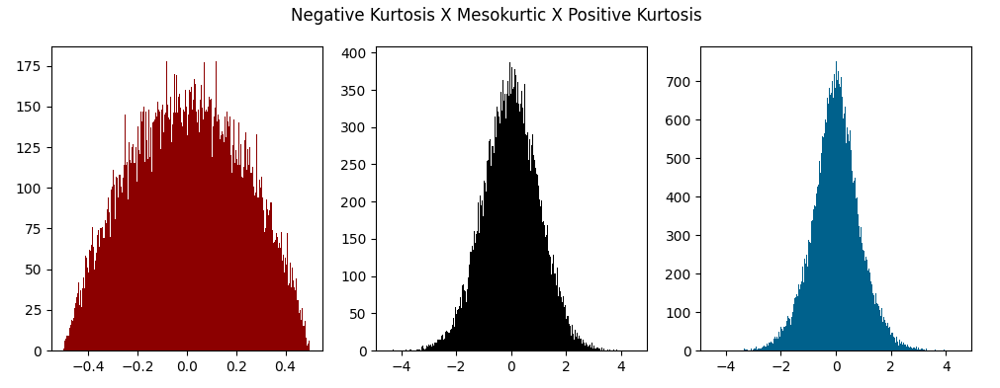

# *Basic Statistics with Python*
## **Summary**
```python
print("Hello Statistics!")
```
Welcome to the *Basic Statistics with Python* course! Here you will learn the fundamentals of statistics and how to apply them using Python. You’ll also get hands-on experience importing and using essential libraries such as NumPy, pandas, Matplotlib, SciPy, and Seaborn.

Throughout the course, we will explore the theoretical meaning of key statistical concepts, covering their general meaning, analytical interpretation, and technical applications.

Statistics is a powerful tool for understanding the behavior of datasets and interpreting what they represent in the real world. It equips you to avoid being misled by false information, extract meaningful insights, and—in more advanced topics—learn how to manipulate data effectively. While this course focuses on the basics, don’t underestimate the value of mastering these foundational concepts. A solid understanding of statistics allows you to quickly extract insights from data, whether by interpreting graphs or analyzing statistical results. Our goal is to provide a well-structured learning experience by combining theoretical knowledge with practical problem-solving.

So, let’s embark on this exciting journey together!

## **Table of Contents**
- [Requirements](##requirements)
- [Central Tendency - Theory](#central-tendency-theory)
- [Central Tendency - Practice](#central-tendency-practice)
- [Central Tendency - Exercises](#central-tendency-exercises)
- [Distribution - Theory](#distribution-theory)
- [Distribution - Practice](#distribution-practice)
- [Distribution - Exercises](#distribution-exercises)
- [Dispersion - Theory](#dispersion-theory)
- [Dispersion - Practice](#dispersion-practice)
- [Dispersion - Exercises](#dispersion-exercises)

## **Requirements**
In this section, we will cover the requirements and some initial setup content.

---

*Jupyter Lab*

To begin with the development environment (for using Python), I recommend using Jupyter Lab. It is a web-based development environment, part of the Project Jupyter, designed for working with notes, code, and data in general. It is easy to use and is by far one of the fastest ways to analyze data, at least in terms of studying.

Jupyter Lab functions like a code editor but allows you to separate your code into blocks and execute them individually. You can create code blocks and note blocks (in Markdown style), which makes it easy to annotate your code in a clean and visually appealing way. This structure helps you organize and identify different parts of your project effortlessly.

To learn how to use this tool, I recommend watching this video:

- https://www.youtube.com/watch?v=5pf0_bpNbkw

Here you will learn how to install Jupyter and start a project. Don’t be intimidated by the initial setup process—it’s straightforward once you get the hang of it.

- "But what if I don’t want to use Jupyter Lab or Jupyter Notebook?" 

Well, you can use VSCode or any other code editor you prefer! However, be aware that using Jupyter Lab or Jupyter Notebook will significantly boost your productivity in the long run. Jupyter Lab makes annotations and split code execution incredibly easy.

---

*Basic Math and functions*

A basic understanding of math and how functions work is essential for a deeper understanding of the calculations involved in statistics. While you won’t need to manually implement statistical formulas (as they are built into libraries like NumPy, pandas, and SciPy), familiarity with numbers and mathematical concepts is highly beneficial.

---

*Python*

Obviously, you will need Python installed on your computer for this course. I am using Python 3.13.1, so be mindful of potential version compatibility issues if your Python version is significantly older.

If you are using VSCode, I recommend installing extensions like Pylance and the Python Debugger to make debugging your code much easier.

This course assumes you have a basic understanding of Python. We won’t use advanced Python features, but we will rely heavily on libraries that connect us to statistical concepts.

---

*Python Libraries*

Some of the libraries listed here will be used occasionally, while others will be used extensively. The most important library you need to install is NumPy, as it provides efficient handling of arrays and numerical operations, making it essential for large-scale data processing. You’ll use it frequently—or its counterpart, pandas, which is built on top of NumPy.

Speaking of pandas, this library is crucial when working with dataframes (similar to spreadsheets). For example, if you have a table of students with three columns—name, age, and final score—you can use pandas to store this data in a DataFrame. From there, you can perform statistical analysis and much more.

These two libraries are the main ones, but we will also use Matplotlib, SciPy, and Seaborn. These libraries will help us create graphs and utilize various statistical functions.

- "How to Install the Libraries?"

To install the required libraries, use the following commands in your terminal (one by one). 

Note: Do not type the > symbol, it simply represents the command prompt.
```cmd
> pip install numpy
> pip install pandas
> pip install matplotlib
> pip install seaborn
> pip install scypy
```

Finally, use this block of code to test if all the libraries are working:
```python
import numpy as np
import pandas as pd
import matplotlib.pyploy as plt
import seaborn as sns
import scipy

# Show the current installed version of the librarie
print(np.__version__)
print(pd.__version__)
print(plt.__version__)
print(sns.__version__)
print(scipy.__version__)
```

## **Central Tendency**

### **Central Tendency (Theory)**

*Note: If you're already comfortable with this topic and understand the nuances well, feel free to skip to the practical part!*

A lot of things in the world can be measured by looking at a single number that represents a large set of numbers. For example, you might judge whether a class of students is performing well by checking if the **mean score** of the entire class is above the minimum passing grade. So, a class with a mean score of 3.5 out of 4 is better than a class with a mean of 3 out of 4, right? Well, not necessarily.

We’ll explore why relying solely on the mean can sometimes mislead us—and others who may not have a strong grasp of basic statistics. The mean can hide important details about the data. That’s where other measures of central tendency, like the **median** and **mode**, come into play.

But before diving into those, let’s clarify what **central tendency** actually means:
- *Central tendency is a central or typical value for a probability distribution. Colloquially, measures of central tendency are often called averages.*

In simple terms, central tendency is about summarizing an entire collection of numbers into a single, representative value. Sounds straightforward, right? Let’s look at the three most common measures of central tendency:
1. **Mean**
2. **Median**
3. **Mode**

Each of these measures does something slightly different, and their results may or may not be the same.

---

#### **1. Mean**
The **mean** of a set of numbers is the sum of all the values divided by the number of values.

- **Example**: (10, 20, 30, 40, 50)
- **Mean**: (10 + 20 + 30 + 40 + 50) / 5 = **30**

You’re probably already familiar with the mean, but let’s see why I said earlier that a class with a mean of 3.5 isn’t necessarily better than one with a mean of 3.

Here are two sets of numbers representing the scores of two classes:

- **First Class**: (0.2, 0.9, 1.5, 2.2, 2.7, 3.5, 4.0, 4.0, 4.0, 4.0)  
  **Mean**: 3.5

- **Second Class**: (2.8, 2.8, 2.9, 2.9, 3.0, 3.0, 3.1, 3.1, 3.2, 3.2)  
  **Mean**: 3.0

At first glance, the first class seems better because its mean is higher. But look closer: the second class is much more consistent. While the first class has some students scoring 4.0 (which is great), it also has five students scoring below 2.8 (the lowest score in the second class). 

The mean of the first class is 16% higher than the second, but 50% of its students scored lower than the worst-performing student in the second class. This shows why you need to be careful when interpreting the mean—it might not always tell the full story.

---

#### **2. Median**
The **median** is the middle value in a dataset when the numbers are arranged in order. It’s like finding the “center point” of the data. If the dataset has an odd number of values, the median is the middle one. If it’s even, the median is the average of the two middle values.

- **Examples**:
  - (1, 2, 3, 4, 5) → **Median**: 3
  - (14, 25, 100, 245, 1000) → **Median**: 100
  - (15, 16, 17, 18) → **Median**: (16 + 17) / 2 = **16.5**

You might be wondering, “Why would I use the median?” Well, the median gives you important insights, especially when used alongside the mean.

Let’s look at two classes that both have a mean of 2.5:

- **First Class**: (1.5, 1.5, 1.5, 4, 4)  
  **Median**: 1.5

- **Second Class**: (0.5, 2.0, 3.0, 3.3, 3.7)  
  **Median**: 3.0

Even though both classes have the same mean, their medians are very different. The first class has a median lower than its mean, while the second class has a median higher than its mean. These differences can reveal interesting patterns in the data.

We’ll explore this further in a future chapter when we discuss **distribution** and **dispersion**, which look at how numbers are spread out in a dataset.

#### **3. Mode**

The last method of central tendency we’ll explore is the **mode**. The mode is the value that appears most frequently in a dataset. While it’s not as commonly used in datasets with many unique values, it’s particularly useful for smaller datasets or when dealing with categorical data.

Let’s look at an example: Imagine we’re studying how many apples 10 people eat every day. Here’s the data:

- **Data**: (0, 0, 0, 1, 1, 1, 1, 2, 2, 3)

In this case, the number **1** appears 4 times, which is more frequent than any other value. So, we can say that **1** is a good representation of the average apple consumption per day.

You might wonder, “Why not just use the mean or median?” Let’s calculate them:

- **Mean**: (0 + 0 + 0 + 1 + 1 + 1 + 1 + 2 + 2 + 3) / 10 = **1.1**
- **Median**: (1 + 1) / 2 = **1**

The mean (1.1) feels a bit odd when talking about “average apple consumption”. The median (1) seems reasonable, but let’s look at two more examples to see why the mode can be more useful in some cases.

---

##### **Example 1:**
- **Data**: (0, 0, 0, 0, 1, 2, 2, 2, 3)  
  **Median**: 1

Here, the median is **1**, but notice that the number **1** only appears once, while **0** and **2** each appear 4 and 3 times, respectively. This can be misleading because the median doesn’t reflect the most common behavior in the dataset.

---

##### **Example 2:**
- **Data**: (0, 0, 0, 1, 1, 2, 2, 2, 2, 3)  
  **Median**: (1 + 2) / 2 = **1.5**

In this case, the median is **1.5**, which is a decimal value. Again, this might not be the most intuitive representation of “average apple consumption.”

---

#### **Why Use the Mode?**
The mode is particularly useful when the data has clear, repeating values or when you’re dealing with categorical data (e.g., favorite colors, types of fruit). 

*Note: You could use the mode to check if a very specific decimal number repeats in a sample of billions of numbers for example, but it is more suited for specific cases.*

---

#### **Key Takeaways**
- **Mean**: Sum of all values divided by the size of the sample.
- **Median**: Middle point in the sample.
- **Mode**: Recognize the number that repeats the most in a sample.

Remember, summarizing data always involves some loss of information. It’s up to you to choose the right tool for the job and interpret the results critically. With practice, you’ll develop a keen sense of when to use each measure of central tendency and understand when a certain value is "biased" and doesn't represents the real meaning of the data.

---

### **Central Tendency (Practice)**

Finally, the practical part! This section is straightforward because it’s very easy to apply these central tendency functions using Python. You’ll only need to import NumPy and SciPy.

NumPy is essentially a library that does what standard Python lists don’t do well: handle numbers efficiently. NumPy arrays use much more sophisticated methods and structures to make our "lists" faster to manipulate, especially when dealing with very large datasets.

On the other hand, SciPy is a library specifically designed for scientific and technical computing. I won’t spend too much time explaining what it does, but for now, know that we’ll borrow a central tendency function from it.

---

#### **Importing Libraries**

```python
import numpy as np
from scipy import stats
```

The first line uses an alias ("np") to call the NumPy library, making it easier to reference throughout the script, and the second line imports only the stats module from SciPy. This means we’re using just a small part of the SciPy library in our code.

---

#### **Creating a NumPy Array**

Let’s start by creating a NumPy array (similar to a Python list). To create a NumPy array, we use np.array() and pass a Python list as an argument, then assign the result to a variable.

```python
array1 = np.array([0, 10, 20, 30, 40, 50, 60, 70, 80, 90, 100])
print(f"Numpy Array 1: {array1}\n")
```

Output:

```terminal
> Numpy Array 1: [  0  10  20  30  40  50  60  70  80  90 100]
```

If you’re not familiar with the second line, it uses an f-string (formatted string literal) to merge text with a variable. By placing the variable inside {}, its value is automatically inserted into the string.

Typing [0, 10, 20, 30, 40, 50, 60, 70, 80, 90, 100] can be tedious, especially if you need a larger range (e.g., 0 to 1000 in steps of 10). Instead, you can use np.arange() to automate this process. Here’s how:

```python
array2 = np.arange(0, 101, 10)
print(f"Numpy Array 2: {array2}\n")
```

Output:

```terminal
> Numpy Array 2: [ 0 10 20 30 40 50 60 70 80 90 100]
```

You’ll notice that, except for the slight formatting difference, the result is the same as the first array. The np.arange() function creates an array that starts at 0, ends before 101 (100).

*Note: If you ever forget how to use np.arange() (or any other function), don’t hesitate to look it up! This is a normal part of learning and coding. Over time, you’ll become more familiar with these tools and use them effortlessly.*

---

#### **Applying Central Tendency Functions**

Now we can put into practice all three central tendency functions we learned! Two of the three functions (mean and median) are available in the NumPy library, while the last one (mode) is available in the "scipy.stats" module.

```python
array2_mean = array2.mean()
array2_median = np.median(array2)
array2_mode = stats.mode(array2).mode # we need to call ".mode" again in the end of the line because the function .mode() returns a object, inside this object we have what we want, the "mode" as an numpy int.

print(f"Array 2 mean: {array2_mean}")
print(f"Array 2 median: {array2_median}")
print(f"Array 2 mode: {array2_mode}")
```

Output

```terminal
> Array 2 mean: 50.0
> Array 2 median: 50.0
> Array 2 mode: 0
```

Pretty simple, right? To call the mean function, we just use .mean() at the end of our NumPy array. To call the median function, we use np.median() and pass our NumPy array as an argument. To call the mode function, we use stats.mode() from the SciPy module, passing the array as an argument.

Note: Sometimes, you’ll notice that not all functions work with the same syntax, such as the mean function (which is a built-in method of the NumPy array class) and the median function (which is a separate function in the NumPy module that requires the array as an argument). Just keep practicing, and these inconsistencies will no longer bother you.

Now we’ve successfully used the three main central tendency functions. But we’re not here just to learn the commands, right? Let’s go further and extract some simple insights.

---

#### **Histogram**

Sometimes, looking at raw numbers—especially in larger samples—doesn’t give you a clear understanding of what the data means. A tool often used to analyze numeric data is graphs, specifically in this case, a histogram!

A histogram is a type of graph that shows how frequently numbers in certain intervals appear in a dataset, in ascending order.

Take this image as a reference:



Here, the x-axis represents the number intervals, and the y-axis represents the frequency of occurrences. For example, in the interval between -0.96 and 0.93, we have more than 17,500 numbers. The blue columns are called "bins," representing the intervals! When creating our own graph, we can specify "how many intervals we want," or technically speaking, how many bins.

Now, look at another example of the same graph with a greater number of bins:



This version gives us a better visual understanding of our data’s structure, but less numerical precision because the intervals are very small. We could increase the image size and add more ticks on the x-axis to indicate more intervals, but that would make the visualization too cluttered for educational purposes.

Note: The more bins we have, the smaller the intervals become, making the graph more precise. Just remember that the number of intervals should be appropriate for the data size and variety.

---

#### **Histogram Graph Plot with Matplotlib**

First things first, "plot" means creating a graphical representation of our data by establishing relationships between two or more variables.

To create a plot of our data (array3), we need to use the "Matplotlib" library. This will allow us to generate basic graphs to better understand our dataset.

Follow the instructions below to create the graph displayed earlier.

First, we need to import Matplotlib alongside our other libraries:
```python
import matplotlib.pyplot as plt
```

Here, we are importing a module from Matplotlib (just as we did with SciPy when importing stats). Writing "matplotlib.pyplot" repeatedly would be inconvenient, so we use the alias "plt" for simplicity.

Before creating our graph, we need a new array. Follow the next command block:
```python
array3 = np.random.normal(loc=0, scale=2, size=50000)
print(f"Numpy Array 3: {array3}\n")
```

Output
```python
> Numpy Array 3: [-0.22725259  2.75397768 -2.31461563 ... -1.73485301  0.62375124  0.46577891]
```


This new function, "random.normal()", generates what we call a "bell curve" with random values. The significance of this type of array will be explained in a future section. For now, just know that the histogram of these numbers will form a bell shape. We specify size=50000 to generate an array containing 50,000 numbers... simple as that.

*Note: The focus here is on creating and interpreting graphs for central tendency. The meaning of the "array3" function will be discussed in another section!*

Now, let’s generate our graph!

```python
plt.hist(array3, bins=200)
plt.show()
```

Output


Creating this type of basic graph is very simple. First, we use the "plt" module to call the hist function. Inside this function, we pass the array as an argument and specify the number of bins (we used 200, meaning 200 intervals!).

The next step is displaying the graph in our screen! If you’re using Jupyter Lab, you only need the first line ("plt.hist(array3, bins=200)") to plot and display the graph automatically. However, if you’re using VS Code or another code editor, you’ll need to add "plt.show()".

Note: We created an array using np.random.normal(), which generates RANDOM numbers based on specified conditions, so your graph may look slightly different from mine.

---

#### **Ploting central tendency values in our hist graph**

Now it’s time to visualize what we’ve learned about central tendency by plotting these values on our histogram. As we learned earlier, let’s calculate the mean and median for our data.

```python
array3_mean = np.round((array3.mean()), 4)
array3_median = np.round(np.median(array3), 4)

print(f"Array 3 Mean: {array3_mean}")
print(f"Array 3 Median: {array3_median}\n")
```

Output

```Terminal
> Array 3 Mean: 0.0067
> Array 3 Median: 0.0049
```

In this code, we introduced the round function, which rounds the results to four decimal places. This is useful because the raw result might contain a long series of digits after the decimal point, making it easier to read and interpret.

With the mean and median calculated, what can we do next? Well, remember that these values give us important insights into the central tendency of the data. If you look at the output (yours may differ because we’re using random data, but it will be similar), you’ll notice that the mean and median are quite close to each other—in this case, with a difference of just 0.0018. This suggests a central peak at 0, where values are most evenly distributed around this point.

To see this visually, let’s plot two vertical lines on our histogram: one for the mean and one for the median:

```python
plt.hist(array3, bins=200) # Old Line

plt.axvline(array3_mean, color='red', linewidth=2, label=f'Mean {array3_mean}')
plt.axvline(array3_mean, color='yellow', linewidth=2, label=f'Median {array3_median}')

plt.show() # Old Line
```
Output


Between the plt.hist() and plt.show() functions, we’ve added vertical lines to mark the mean and median values. This allows us to visually see what they represent in our graph.

*Note: If you notice that only the "yellow line" is visible, it's because the red line is positioned very close to the yellow one. Since the values for the mean and median are so similar, the red line is obscured behind the yellow one (which was plotted last and overlaps the first line).*

With both lines in the middle, we can clearly see that they are near the center of our "bell curve" graph. This confirms that the curve is symmetric. In a symmetric distribution, the numbers less than the mean (0) are nearly proportional to the numbers greater than 0, creating this balanced shape.

- "But what if the mean were different from the median?"

In that case, the graph would become asymmetric! Let’s explore this further.

We’ll create a new .py file with the following code to generate a new, non-symmetrical distribution:

```python
import numpy as np
from scipy import stats
import matplotlib.pyplot as plt

# -- new array!
array4 = stats.skewnorm.rvs(a=3, loc=0, scale=2, size=50000)
mode_adjustment = np.percentile(array4, 50) 
array4 -= mode_adjustment
# -- new array!

array4_mean = np.round(array4.mean(), 4)
array4_median = np.round(np.median(array4), 4)

plt.figure(figsize=(14,8))
plt.hist(array4, bins=200)

plt.axvline(array4_mean, color='red', linewidth=2, label=f"Mean: {array4_mean}")
plt.axvline(array4_median, color='Chartreuse', linewidth=2, label=f"Median: {array4_median}")

plt.xlabel('Values')
plt.ylabel('Frequency')

plt.legend()

plt.show()
```
Output


In this case, array4 is created to have a skewed bell curve. Notice that the mean is greater than the median. Visually, you can see that while the peak of the graph is still centered at 0, the right side is stretched more than the left side.

This asymmetry implies that if we were to interpret this graph as representing something like average hourly salaries, the median would provide a better representation of the data than the mean. This is because the mean is pulled to the right due to the presence of a few high values. This type of distortion is often used in political propaganda to skew the public's understanding of the data.

- "How does this happen?"

Imagine that we add a very high set of values to our data set (numbers around 25-30). This will stretch the distribution to the right! Let’s add those high values and see what happens:

```python
#--old code
array4 = stats.skewnorm.rvs(a=3, loc=0, scale=2, size=50000)
mode_adjustment = np.percentile(array4, 50)
array4 -= mode_adjustment 
#--old code

#---new (adding new high values to our array)
newar = stats.skewnorm.rvs(a=-10, loc=30, scale=2, size=5000)
array4 = np.append(array4, newar)
#---new

#--old code
array4_mean = np.round(array4.mean(), 4)
array4_median = np.round(np.median(array4), 4)

plt.figure(figsize=(14,8))
plt.hist(array4, bins=200)

plt.axvline(array4_mean, color='red', linewidth=2, label=f"Mean: {array4_mean}")
plt.axvline(array4_median, color='Chartreuse', linewidth=2, label=f"Median: {array4_median}")

plt.xlabel('Values')
plt.ylabel('Frequency')

plt.legend()

plt.show()
#--old code
```

Output


After adding these extreme values, you can see that both the mean and the median have shifted. The mean moved almost 2.7 units to the right, while the median only shifted 0.1 units. If you used the mean to represent the central tendency of the data, it would be misleading. The more asymmetrical the graph, the greater the discrepancy between the mean and median.

---

### **Central Tendency (Exercises)**

Now that you’ve learned how to calculate the mean and median, and how these measures behave in symmetric and asymmetric distributions, let’s practice with some exercises. Here you will practice with 6 problems (1 to 6)!

You can check the solutions here: [Exercise Solutions](exercises_solution)

*Note: If you struggle to solve a problem and don’t succeed, try not to check the answer immediately. Instead, take a step back—reread my explanations or research the topic on Google. This approach will help you understand the concept better and improve your learning!*

#### ------------------------- Exercise 1 -------------------------
Given the following array:
```python
array = np.array([12, 15, 17, 19, 22, 23, 25, 29, 31, 35])
mean = ?
median = ?

print(f"Mean: {mean}, Median: {median}")
```
Calculate the "mean" and the "median" using *np.mean()* and *np.median()* AND tell if the graph will be almost symmetric or asymmetric.

#### ------------------------- Exercise 2 -------------------------
Given the following array:
```python
array = np.array([5, 10, 15, 25, 50, 70, 100, 200])
mean = ?
median = ?

print(f"Mean: {mean}, Median: {median}")
```
Calculate the "mean" and the "median" using *np.mean()* and *np.median()* AND tell if the graph will be almost symmetric or asymmetric.
#### ------------------------- Exercise 3 -------------------------
Given the following array:
```python
array = np.array([1, 3, 4, 4, 5, 7, 8, 9, 9, 10, 12, 13, 14, 15, 16])
mean = ?
median = ?

print(f"Mean: {mean}, Median: {median}")
```
Calculate the "mean" and the "median" using *np.mean()* and *np.median()* AND tell if the graph will be almost symmetric or asymmetric.
#### ------------------------- Exercise 4 -------------------------
Consider the following histogram.

Observe the graph below and answer the following:


Is the mean equal to, greater than, or less than the median?
Provide a brief explanation based on the graph.
#### ------------------------- Exercise 5 -------------------------
Consider the following histogram.

Observe the graph below and answer the following:


Is the mean equal to, greater than, or less than the median?
Provide a brief explanation based on the graph.
#### ------------------------- Exercise 6 -------------------------
Consider the following histogram.

Observe the graph below and answer the following:


Is the mean equal to, greater than, or less than the median?
Provide a brief explanation based on the graph.

---

## **Distribution**

### **Distribution (Theory)**

*Distribution* is the second part of the three main characteristics of the shape of a dataset (the first being Central Tendency). If you take the word "distribution," you will see that we are talking about how things are distributed in our graph! While before we focused on the center of our curve (mean, median, mode), now we are going to put full focus on what happens with the shape in general (including the borders and not just the middle part).

Being honest, I have already taught you the following topic but in very simple terms. You used Central Tendency values to understand how the curve graph might look... Now, it's time to learn the full technical names and look deeply into the details.

When you see that "stretching" effect I talked about, the correct name is **Skewness**!

---

#### Skewness

This topic will already be familiar to you because we studied it before when we looked at the mean and the median in a graph and how they shape the curve. Simply put, a "skewed" graph is a graph that has a bigger *tail* on one side than the other.

Look at this graph that you have already seen in exercise 5 in the [Central Tendency exercises](#central-tendency-exercises):


This is a graph with a **Positive Skew**, and when we say *positive*, it is because the "tail" of the graph is stretched to the *positive* side. This means that we have values that are not necessarily positive but are positive compared to the tip of the curve. It's like all the values to the right are positive compared to the values to the left—simple as that.

In this other example, we see the opposite of a positive skew, which means a **Negative Skew**:


Here, you see that the values that are "deforming" our graph are on the negative side of our curve, or simply put, the left side!

- *"And what if the curve has a symmetric shape? Like when the mean and the median are mostly equal?"*

In that case, we do not have a skew! Obviously, it is very hard to have a histogram with real data (like math scores in a student class) that forms a perfect "bell curve," but sometimes we can simply assume that the graph is almost a perfect bell curve. That example is in exercise 4, which you have already seen before:


In that case, you can assume that the "mean" and the "median" are almost the same. If you look closely at the graph, the right side is not perfectly equal to the left side, but if you take a more generous perspective, it looks very similar.

- *"Very cool... But can't we calculate some 'skew' value in a graph?"*

Yes, you can! The actual formula is quite complex compared to the "mean" or "median" formulas, so we will keep this calculation for the practice section, using Python. You can see why here:



But this doesn't stop us from learning what the result of the skewness formula looks like, so let's take a quick look at the results of the three graphs listed before:

- Positive Skew Graph: 0.85

- Negative Skew Graph: -0.85

- No Skew Graph: -0.009 (Almost 0)

So, the skewness value has a very straightforward interpretation: when the result is greater than 0, the graph has a **positive skew**. When the result is less than 0, the graph has a **negative skew**.

In the "no skew graph" example, the skewness result was *-0.009*, meaning that the graph is slightly skewed to the left (negative skew), but we can abstract that information and assume that the skewness is almost 0, meaning "no skew." (Remember, assuming that the graph's skew is almost 0 doesn't mean that the skew is exactly 0.)

We will learn in the practice section how to easily calculate this without needing this *horrendous* formula. Instead, we will use a skewness function from **scipy.stats**!

---

#### Kurtosis

Another strange name to describe a very simple topic. But this time, it is a topic that we have not covered before.

Kurtosis provides information about the "peak" of our curve, or more correctly, it refers to the degree of "tailedness."

More technically speaking, Kurtosis describes how data is spread around the *mean*. The way that the frequency of values around the mean rises and falls affects the shape of the distribution.

Look at this image as a reference:



Here we have three types of kurtosis: *Negative Kurtosis*, *Mesokurtic*, and *Positive Kurtosis*. Each of these indicates how much the values in the tail relate to the mean. 

Before we look at each value, let's briefly explain what "slope" means (If you already know, feel free to skip this part). In a 2D graph, the slope of a function represents how steep a line is, describing the rate at which the y-value changes as the x-value increases. Mathematically, it is defined as the change in y divided by the change in x (Δy / Δx). However, in the context of kurtosis, we are not dealing with a simple linear slope but rather the overall shape of the curve. While a positive kurtosis curve rises sharply around the mean (steeper peak), a negative kurtosis curve is flatter, meaning the values are more evenly spread out. For a deeper understanding of slope in general, check out this: [Slope in wikipedia](https://en.wikipedia.org/wiki/Slope)

Now, let's analyze the three graphs:
- **Negative Kurtosis**: Here, we have a high initial slope that decreases when the frequency of values is similar to the frequency of the mean. The graph looks a lot like a negative quadratic function graph. The data is evenly spread and does not have extreme concentration near the mean.
- **Mesokurtic (Normal)**: It has a moderate spread of values around the mean, forming a balanced distribution. It can be abstracted as resembling a linear function.
- **Positive Kurtosis**: It has a low initial slope that increases rapidly as it approaches the mean (similar to an exponential function). This distribution contains a mix of small variations and a few very large differences (outliers).

In practice, kurtosis helps in understanding risk, variability, and the presence of outliers.

### Insights from each type of Kurtosis:
- **Negative Kurtosis**: Your data has fewer extreme outliers and is more evenly spread. Useful when extreme deviations are unlikely.
- **Mesokurtic (Normal)**: Your data has a balanced distribution with mild variations.
- **Positive Kurtosis**: Your data has more extreme outliers than a normal distribution. It's useful for risk assessment (e.g., financial markets) and anomaly detection (e.g., fraud detection).

So, summarizing, in this chapter we have explored how skewness and kurtosis describe the shape of a distribution, focusing on both the length of the tails and the "sharpness" of the curve. These two tools provide important insights into the characteristics of our data!

Finally, I want you to think: *"Why is the name of this entire chapter 'distribution' and how does its meaning relate to skewness and kurtosis?".* This will enhance your understanding of the concepts and encourage critical thinking.

---

### **Distribution (Practice)**

This chapter on distribution is the most abstract of the three in this mini-course. Visually, it might seem straightforward, but when you start thinking about the actual data, its values and frequencies, it can get a bit tricky. So, before we dive in, I encourage you to really visualize how the data behaves. Try to picture how numbers are distributed, not just the shape of the graph. Use the practice section to bring these concepts to life and make them easier to understand!

---

#### *Calculating Skewness*

First, we need three arrays to represent each example of skew (normal, positive and negative). For this, i'm importing "scipy.stats.skewnorm.rvs()" to create a curve that have a certain value of skew. You can look at the file [skew_python.py](distribution_python/skew_python.py) and follow here.

*Note: You don't need to decorate these array creation functions, just try to understand in theory what they are doing.*

```python
import numpy as np
import matplotlib.pyplot as plt
from scipy import stats

# SKEW CALCULATIONS

array1 = stats.skewnorm.rvs(a=0, loc=100, scale=4, size=50000)
array2 = stats.skewnorm.rvs(a=5, loc=100, scale=4, size=50000)
array3 = stats.skewnorm.rvs(a=-5, loc=100, scale=4, size=50000)

array1_skew = stats.skew(array1)
array2_skew = stats.skew(array2)
array3_skew = stats.skew(array3)

# RESULTS

print(array1_skew, array2_skew, array3_skew)
```

Output
``` terminal
> 0.002230572975589915 0.8513237055319836 -0.860770190259566
```

Let's break this down step by step, making it more clear and simple:

For each array, we use the rvs() function to create an array of size 50,000. The scale is set to 4 (don’t worry if this doesn’t make complete sense yet—we’ll explain it more in the next chapter. For now, just think of it as a way to control how spread out the values can be from the mean). The loc is set to 100, which represents the mean of the distribution (in simple words, it's where the center of the graph will be).

Now, you might notice that the last argument in the rvs() function is "a". This is the skew of the distribution! Take a close look at the rvs() function for array1, array2, and array3. The only thing that changes between them is the value of "a":
- Array 1 has *a* = 0, which means it has almost no skew
- Array 2 has *a* positive skew because *a* is a positive number
- Array 3 has *a* negative skew because *a* is a negative number

The larger the value of "a" (either positive or negative), the more skewed the array becomes. This means the graph will become more stretched out in one direction.

Next, let’s talk about the "skew()" function, which comes from scipy.stats. It does exactly what you think—it calculates the skew value of an array. To use this function, all you need to do is pass in your array, and it will give you the skew value.

Now, let’s take a look at the results for the three arrays:

- Array 1: 0.002

- Array 2: 0.851

- Array 3: -0.860

The first value, as expected, is close to zero (which indicates that the array is "normal," based on our abstraction). The second value is noticeably positive, while the third value is the opposite, being negative. Pretty straightforward, right?

- "Cool, but what can I do with this value?"

Good question! The skew value is super useful when you’re looking for outliers—values that are far away from the rest of the data.

- [10.000, 12.000, 12.500, 15.000, 16.000, 16.000, 100.000]

Can you identify the type of skew in this array? Take a look at how the values relate to each other. If you guessed positive skew, you’re spot on. But why is that? 

We have values ranging from 10,000 to 16,000, which could represent, for example, monthly salaries of workers. Then, suddenly, there’s a salary of 100,000 in the data. This outlier causes the distribution to skew, and because the outlier is much higher, we say it’s skewed to the right (positive). If you calculate the mean and median, you’ll notice that the mean will be larger than the median. 

Here are the statistics:

- [10.000, 12.000, 12.500, 15.000, 16.000, 16.000, 100.000]
- Mean: 23.07
- Median: 15.0
- Skewness: 2

As you can see, the skew value of 2 indicates that the data is distorted to the right, and the outlier (100.000) is likely an invalid value or outlier that we might want to reconsider.

In simple terms, if your data is skewed, take a closer look at the values to figure out what’s causing the skew. If you find a value that seems out of place or doesn’t make sense, it’s probably an outlier, and you may want to ignore it in your analysis. In the exercise session, you will practice this concept with exercises!

---

#### *Calculating Kurtosis*

You've learned how to calculate skewness - now let's tackle kurtosis! The interpretation is similar: the further the result is from zero, the more pronounced the effect.

We'll create three datasets (one for each kurtosis type) and then use SciPy's kurtosis function. Follow along with the code in [skew_python.py](distribution_python/kurt_python.py).

```python
import numpy as np
import scipy.stats as stats
import matplotlib.pyplot as plt

np.random.seed(42)
data = np.random.normal(loc=0, scale=1, size=50000)

data_pos_kurt = np.concatenate([data, np.random.normal(loc=0, scale=0.5, size=25000)])

data_neg_kurt = (np.random.beta(a=2, b=2, size=50000) - 0.5)

print("Kurtosis (Base Normal):", stats.kurtosis(data, fisher=True))
print("Kurtosis (Positive):", stats.kurtosis(data_pos_kurt, fisher=True))
print("Kurtosis (Negative):", stats.kurtosis(data_neg_kurt, fisher=True))
```
Output
```Terminal
Kurtosis (Base Normal): 0.0010178213947216186
Kurtosis (Positive): 0.6665276676870309 
Kurtosis (Negative): -0.8533828238297594
```

Don't worry about how we created the arrays - just focus on the stats.kurtosis() function from SciPy.

Key observations:

- Normal kurtosis ≈ 0 (balanced tails)

- Positive kurtosis > 0 (heavier tails, more outliers)

- Negative kurtosis < 0 (lighter tails, fewer outliers)

When you get a number close to zero, that's your basic normal distribution with regular tails. But when that number starts climbing into positive territory (like our 0.67), that means you've got some fat tails going on - more extreme values than you'd normally expect. On the flip side, when it dips negative (like our -0.85), you're looking at thinner tails with fewer outliers. The bigger the number from zero, the more dramatic this tail behavior gets.

Now about that "fisher=True" thing - it's basically there to make your life easier. See, normally a perfect bell curve would give you kurtosis of 3, which is kinda weird to work with. So Fisher's adjustment just subtracts 3 to bring it down to zero. That way, when you see our normal result of 0.001 instead of 3.001, it's way more obvious at a glance what's going on.

So now you've got two slick tools in your stats toolbox - skewnorm.rvs() for checking skewness and kurtosis() for tail analysis.

### **Distribution (Exercises)**

It's time to practice! You can check the solutions here: [Exercise Solutions](exercises_solution)

#### ------------------------- Exercise 7 -------------------------
Given the following array:
```python
import numpy as np
import scipy.stats as stats

array = np.arange(-100, 100, 2)
skewness = ?
kurtosis = ?

print(f"Skewness: {skewness}, Kurtosis: {kurtosis}")
```
Calculate the value of skewness and kurtosis, and finally calculate 